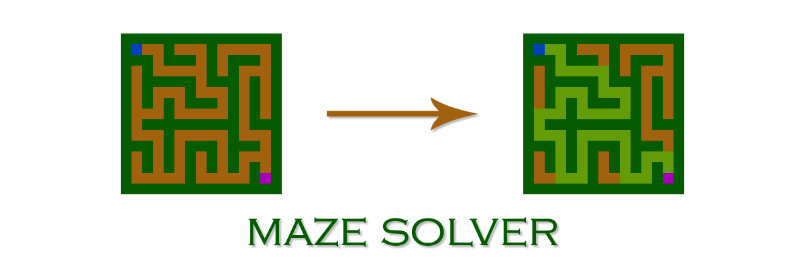
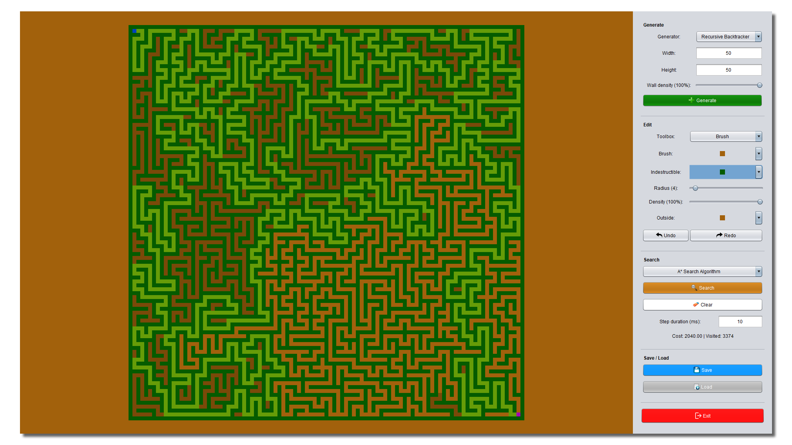
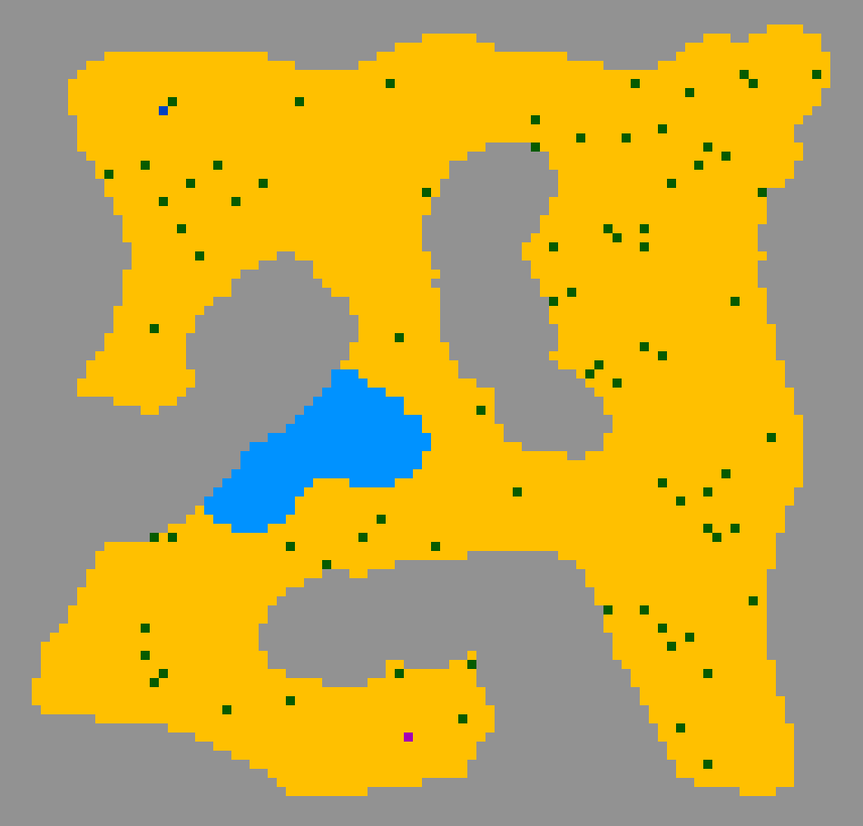
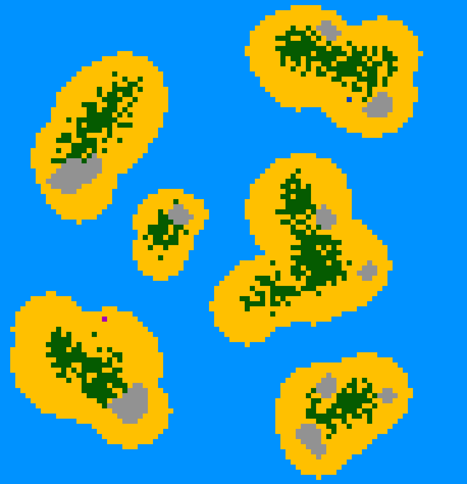
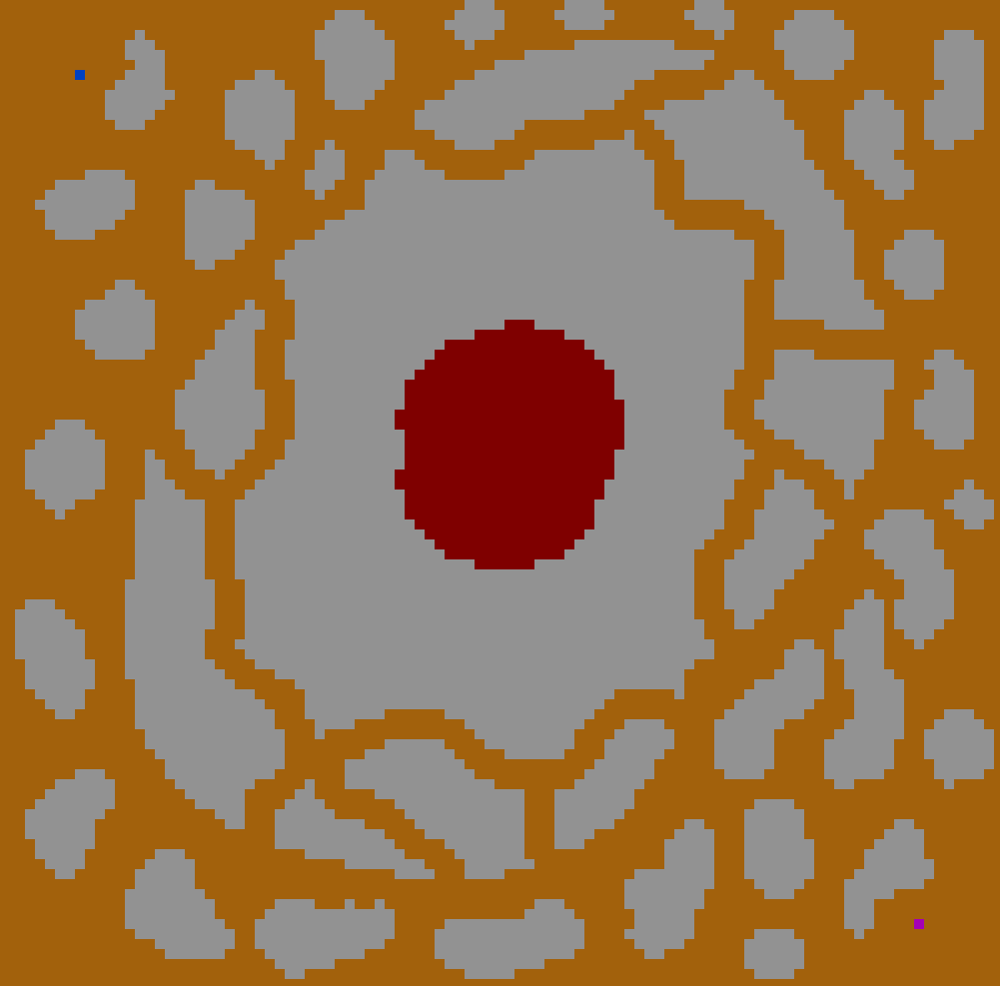
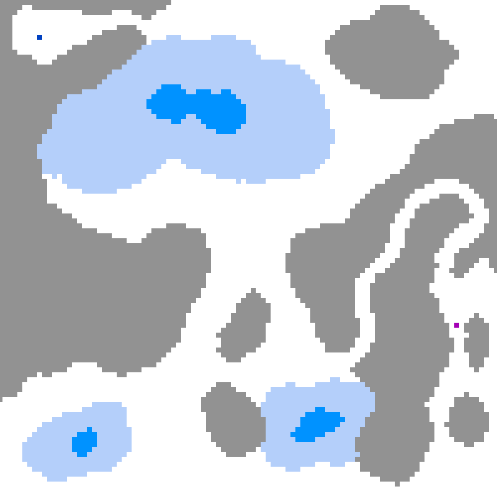
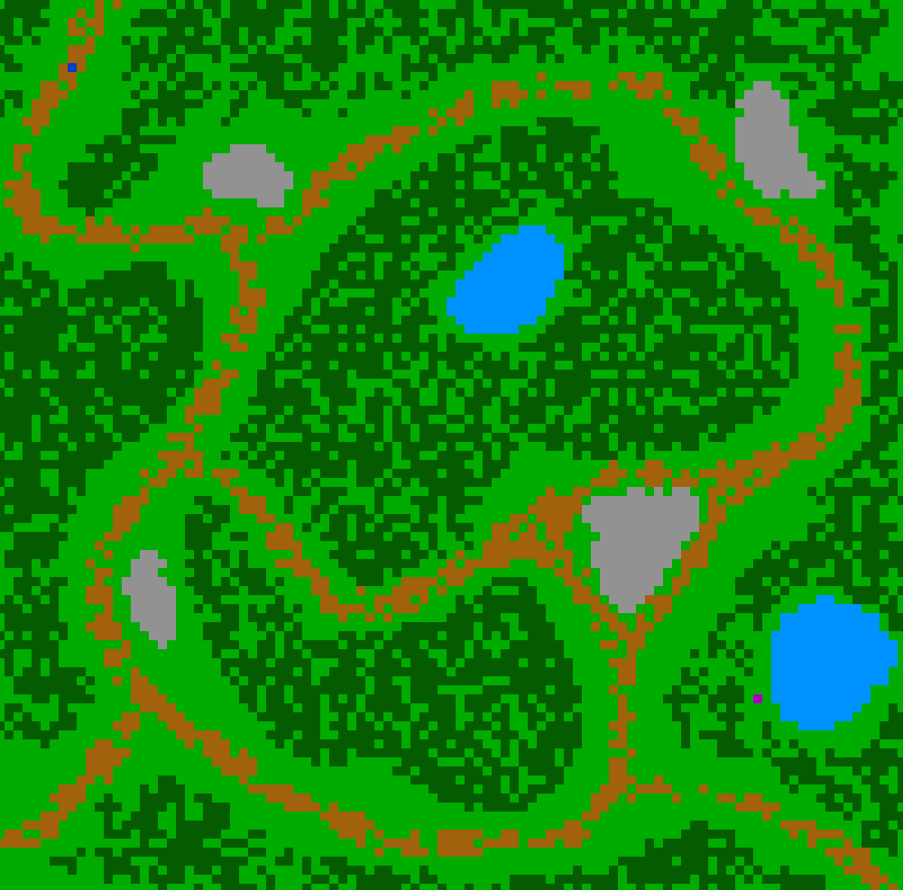

# ❓ What is it?
Maze solver is an application which allows the user to:
1. Generate mazes using various maze generation algorithms.
2. Edit maze using tools such as a brush or a fill-bucket.
3. Run selected search algorithm to find a path from start to finish cells.

# 🕹️ Control panel
Maze solver's user interface is very simple, containing only a single window of controls on the right side of the screen called *control panel*. Control panel contains 4 sections:
* **Generate** - used to generate mazes.
* **Edit** - used to edit mazes.
* **Search** - used to search mazes.
* **Save/Load** - used to save and load mazes to/from files.

## ➕ Generate

Generate section is used to generate mazes and offers the user following options:
* **Generator** - option that allows the user to select the maze generation algorithm. Possible options are:
  * *Recursive backtracker* - generates long passage, hard to solve and visually appealing mazes.
  * *Binary tree* - generates easy to solve mazes that will have a diagonal solution bias.
  * *Sidewinder* - generates medium difficulty mazes that will have a vertical solution bias.
  * *Prim* - generates medium difficulty mazes with medium length passages.
* **Width** - defines the width of the maze.
* **Height** - defines the height of the maze.
* **Wall density** - defines the percentage that the wall cell **won't** be deleted after the maze has been generated.

**NOTE:** The actual number of cells in width is **Width** * 2 + 1. Similarly, the actual number of cells in height is **Height** * 2 + 1. This is made so that the number of cells in any dimension is always odd, which allows for a better looking maze generation.

---

## 🖌️ Edit

Edit section is used to edit mazes and offers user the following options:
* **Toolbox** - option that allows the user to select the edit tool. Possible options are:
  * *Brush* - paints the maze terrain with selected cell type.
  * *Bucket* - flood-fills area with selected cell type.
  * *Start marker* - defines the start cell position.
  * *Finish marker* - defines the finish cell position.
* **Brush** - allows the user to select the cell type used for editing the maze terrain.
* **Indestructible** - list of cell types which cannot be edited by the brush tool.
* **Radius** - radius used by the brush tool.
* **Density** - density used by the brush tool.
* **Outside** - cell type used to paint area outside the of the maze.

---

## 🔍 Search

Search section allows the user to search mazes using the preferred search algorithm. It offers the following options:
* **Algorithm** - algorithm used for the search. Possible algorithms include:
  * *A\* Search Algorithm*
  * *Dijkstra's Algorithm*
  * *Greedy Best-First Search*
  * *Breadth-First Search*
  * *Depth-First Search*
* **Step duration** - defines the search animation speed.

---

## 💾 Save/Load

Mazes can be saved to and loaded from files.

**Saving the maze**
1. Click on the **Save** button - the save dialog should open.
2. Define the save file name - extension *.maze* will be automatically added to the file name.
3. Select save destination by navigating the file system.
4. Click on the **Save** button in the opened dialog to save the maze to the specified location.

**Loading the maze**
1. Click on the **Load** button - the load dialog should open.
2. Locate and select the file which contains the maze data - it should be a file with *.maze* extension.
3. Click on the **Load** button in the opened dialog to load the maze from the selected file.

# 🗺️ Examples

## 🌵 *enclosed-desert.maze* (Dijkstra's algorithm)

## 🏝️ *tropical-islands.maze* (Dijkstra's algorithm)

## 🌋 *cracked-volcano.maze* (A* search algorithm)

## ❄️ *frozen-lakes.maze* (Dijkstra's algorithm)

## 🌳 *forest-walk.maze* (A* search algorithm)

And that is all! Have fun playing with the maze solver! 🙂
